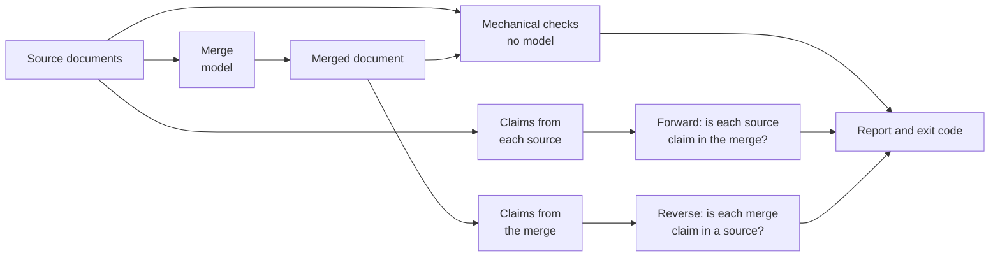

# LLossless

**Merge documents with a language model, then check, claim by claim and in both
directions, that nothing was lost, changed or made up.**

Ask a language model to combine two documents and you get something that reads
well, and that is the problem: a dropped sentence leaves no gap, a silently chosen
value looks decided rather than guessed, and an invented detail is written in the
same confident voice as the real ones. LLossless merges, then holds the result
against its sources: every fact in a source must survive into the merge, and
every fact in the merge must come from a source. Each failure comes back with a
name, a quote and a line number. The check cannot be turned off.

[What it does](#what-it-does) · [A real example](#a-real-example) ·
[Install](#install) · [Quick start](#quick-start) · [What to expect](#what-to-expect) ·
[Under the hood](#under-the-hood) · [The benchmark](#the-benchmark) ·
[Lessons learned](#history-and-lessons-learned) · [Documentation](#documentation)

<picture>
  <source media="(prefers-color-scheme: dark)" srcset="https://github.com/user-attachments/assets/cf0a9646-d93f-4ca5-bd78-a13dc0bc4459">
  
</picture>

*The web interface after a run with findings. The answers in this screenshot
came from a scripted test endpoint (`test-model`), not from a real model.*

## What it does

- **Merges** two or more Markdown or plain-text documents with the model you
  choose. It can also **check a merge you already have**, however it was made,
  claim by claim.
- **Checks the mechanics without a model.** On every merge it writes,
  numbers, units, URLs, file paths, versions, commands and code blocks must
  survive unchanged; every source sentence must be present or accounted for;
  titles and repeated content are checked too. These checks are plain string
  and set comparisons, so anyone can verify a finding by hand.
- **Checks the meaning with a model.** Both sources and the merge are split into
  short factual claims. Each source claim is looked for in the merge, and each
  merge claim is looked for in the sources. Every verdict has to quote its
  evidence, and a quote that is not in the file it names is flagged.
- **Lets you choose how freely it may reword**, from copying sentences verbatim
  to editing like a careful human editor, while numbers, links and code stay
  protected at every level.
- **Reports everything**, found or not: a verdict, the counts behind it, each
  finding with its evidence, the fate of every claim, and a record of which
  model, settings and prompts produced it. The exit code tells a script what
  happened.
- **Runs on your machine** with your own local model, API keys or Claude
  subscription, from the command line or a web interface. It has no
  telemetry, and nothing leaves the machine except the calls to the model you
  configured (and, at fiddelity level `sourced`, that model's own web searches).



The two directions give the same verdict two different meanings:

| direction | the model finds a claim | reported as |
|---|---|---|
| source to merge | missing | **dropped**: a fact in a source did not survive |
| source to merge | partly there | **partly dropped**: carried with a detail missing |
| source to merge | contradicted | **contradicted**: the merge states a different value |
| merge to sources | missing | **invented**: the merge asserts what no source does |
| merge to sources | partly there | **partly invented**: a real fact with an added detail |
| merge to sources | contradicted | **contradicted**: the merge disagrees with its sources |


## Install

Python 3.11 or newer. Zero runtime dependencies: the HTTP client is
`urllib.request` from the standard library.

```sh
git clone https://github.com/toby-sutor/LLossless/ llossless
cd llossless
```

## Quick start

### 1. Tell it which model to use

LLossless has three roles: `merge` writes the merged document, `decompose`
splits documents into claims, and `verify` checks them. Each can use a
different model and endpoint. Pick one of three routes.

**A local model (the default).** The default endpoint is a local
Ollama at `http://localhost:11434/v1`. Copy
`models.local.example.json` to `models.local.json` and name your model:

```json
{ "merge": "qwen3:8b", "verify": "qwen3:8b" }
```

Give Ollama room: a merge needs more context than its default, so start it with
`OLLAMA_CONTEXT_LENGTH=16384` or more. `decompose` uses the `verify` model
unless you name one.

**A vendor API.** Point it at the vendor's OpenAI-compatible address, choose
the request profile, state the model's context window and supply a key:

```sh
export LLOSSLESS_BASE_URL=https://api.anthropic.com/v1
export LLOSSLESS_PROFILE=anthropic          # or openai-reasoning, google
export LLOSSLESS_WINDOW=200000              # the model's context window
export LLOSSLESS_THINKING=decompose,merge,verify   # frontier models were measured with reasoning on
export LLOSSLESS_API_KEY=...                # or name another variable in LLOSSLESS_API_KEY_ENV
```

The key is read at send time and never written to a report, a log or the cache.
A key is never sent over plain `http://` to another machine.

**A Claude subscription.** LLossless can answer through the `claude` command
line instead of a metered API. The web interface finds an installed `claude`
and switches it on with one toggle; on the command line it is
`--answer-with` and a few variables, listed in the
[reference](docs/reference.md#answering-through-a-program). Subscription runs
are not priced per call, and they are not reproducible run to run.

### 2. Merge two documents

```sh
llossless merge notes-a.md notes-b.md --base notes-a.md -o merged.md > report.md
```

`--base` names the document whose structure the merge follows. The report goes
to stdout, the merged document to `-o`, and progress to stderr. Add `-v` to
watch each step, or `--dry-run` to count the calls before spending anything.
`--html report.html` also writes the report as one self-contained page.

### 3. Or check a merge you already have

```sh
llossless verify notes-a.md notes-b.md merged.md > report.md
```

`verify` makes no merge call, so it is the cheaper of the two. Tell it how the
merge was allowed to reword (`--fidelity`, below), or it assumes the default.

### The web interface

```sh
llossless serve
```

The first start prints a one-time address. Open it, create the first account,
paste an API key or switch on a detected `claude` route, then drop in two or
more documents and press **Merge and check**. The page shows each step as it
runs and ends on the report, with the merged document, the HTML report and a
zip of everything for download. It listens on `127.0.0.1` port `8765` only 
unless told otherwise via `--port` and `--host`.

What it adds over the command line:

- **Accounts, each with its own API keys and endpoints**, for a small shared
  deployment. A key is bound to the address it was saved against.
- **A model picker with measured figures**: cost, speed, silent loss and
  deviations per model, where they have been measured, and a scorecard with the
  dates and notes behind every figure.
- **Runs that survive**: a queue that outlives a restart, cancel and retry, and
  a browser notification when a run ends.
- **Privacy defaults**: uploaded documents and reports are deleted 48 hours
  after a run finishes unless the admin changes that setting.
- **English and German**, for the page. The reports stay in English.

[The web interface](docs/web.md) documents all of it, including the JSON API.

## Operating it

### How freely it may reword: fidelity

| level | the merge may |
|---|---|
| `verbatim` | only copy sentences from the sources, choosing which version to keep and in what order |
| `low` | make mechanical corrections: spelling, punctuation, grammar |
| `mid` | rewrite sentences |
| `high` (default) | edit like a careful editor, and state what the sources together entail |
| `open` | also settle a disagreement with a value covering both, or add a statement from outside the documents, but only as a declared record naming its basis |
| `sourced` | same as `open`, with the model looking facts up on the web rather than recalling them; needs a route that can be granted web search |

At every level, numbers, units, URLs, paths, versions, commands and code blocks
must survive exactly, and changing one is a finding. Whatever the merge chose
not to carry over, it has to declare, and the declarations are checked.

### How thoroughly it checks: verification depth

`--verify-depth full` (the default) runs both directions. `coverage` skips the
reverse pass: cheaper, and it answers only whether the sources survived, never
whether the merge invented something. The mechanical checks run at both depths.

### Models and routes

Any OpenAI-compatible endpoint works: Ollama, vLLM, the Anthropic, OpenAI and
Google APIs, or a subscription CLI through `--answer-with`. Each role can have
its own model (`--merge-model`) and its own endpoint, so an expensive model can
write the merge while a cheaper or local one does the checking.

### Exit codes

| code | meaning |
|---|---|
| **0** | every claim accounted for, no finding |
| **1** | a problem in the merged document: something dropped, contradicted, invented or changed, or too much declared dropped |
| **3** | the merged document is sound as far as the checks looked, but the merge misdescribed what it did |
| **2** | the run could not finish: bad configuration, an unreachable endpoint, or a model that would not answer usably |

When several apply, 2 beats 1 beats 3. A run that checked nine of twelve claims
and found no fault has not shown the other three are sound, so any unfinished
unit of work makes the whole run inconclusive.

### Where the rest is

- [Command-line reference](docs/reference.md): every flag and environment
  variable, the cache, the output while it runs, and the context-window limits.
- [The web interface](docs/web.md): accounts, keys, routes, the picker,
  retention and the JSON API.
- [Reading the report](docs/report.md): every section of the report.

## What to expect

**It finds what it is built to find.** On the 13 pre-registered test documents,
each a merge with a known defect or none, the full check found 7 of 7 planted
defects and wrongly flagged 0 of 116 correct statements it graded (one model,
one run). The cheaper `coverage` depth found 6 of the 6 defects it can reach
and ran 2.04x faster.

**Models do lose things.** On the nine public document pairs, every model
measured so far deviated from a careful hand-written merge, and 3 of the 7
current rows in the benchmark matrix lost content without declaring it. Those
are the losses a reader of the merged document cannot see.

**Cost and time.** On those pairs, each source under 6 KB, one merge with all
its checks cost $0.012 to $0.467 through a vendor API and took 64 to 294
seconds; through a subscription CLI it took 210 to 645 seconds. A local model
costs nothing per call and runs at the speed of your hardware. Cost and time
grow with length: every document gets its own calls, and verification is paid
per batch of claims.

**Known limitations:**

- **It checks facts, not writing.** A merge that reads badly passes, and a pure
  change of notation is not a finding.
- **Long documents are checked more coarsely.** Claims get bigger as documents
  get longer, and one claim that bundles three facts can hide a dropped one.
  [Measured, not yet fixed](docs/results.md#known-limitation-claims-coarsen-as-documents-get-longer).
- **Source code is treated as prose.** Code inside fenced blocks in a document
  is protected; whole source files are not. Do not use it to merge code.
- **It merges unrelated documents if asked.** It does not decide what belongs
  together. In the one measured case, the declared-loss budget made that run
  fail loudly.
- **Two sources are what has been measured.** Three or more are accepted and
  checked, but no published figure covers them.
- **The checker is a model too.** Its verdicts must quote real evidence, which
  catches a fabricated quote but not every wrong judgement, and claim
  extraction varies a little between runs.
- **The evidence base is small**: short hand-written test documents, mostly
  English, and mostly one run per cell.

[Measured results](docs/results.md) has the figures behind all of this,
including where the project's own headline metric misleads.

---

## Under the hood

This half is for readers who want to know how it works and whether to trust it.

### The pipeline

1. **Segment.** Each source is split into segments: sentences, headings, list
   items, table rows and fenced blocks, each with its line number.
2. **Merge.** The model is shown the segmented sources and returns the merged
   document plus a record for every segment it did not copy word for word:
   reworded, superseded, subsumed, duplicated or dropped, each with a reason.
   At `open` and `sourced` it can also declare an addition from outside the
   documents, with its basis.
3. **Reconcile.** Nine mechanical checks hold the merged text and those
   records against the sources. No model is involved. (Checking an existing
   merge with `verify` skips steps 2 and 3, since there are no records to hold
   it to, and starts here.)
4. **Decompose.** Each source and the merge are split into atomic claims, each
   anchored to a quoted span and a line.
5. **Verify, both ways.** Source claims are graded against the merge, merge
   claims against the sources, in batches. Every verdict must quote its
   evidence.
6. **Report.** Findings, the fate of every claim, the declarations with
   whether the evidence confirms them, and a provenance block.

### Mechanical first, the model second

Anything that can be checked by comparing strings is checked that way: a
number that changed, a link that lost a character, a code block re-indented, a
source sentence that vanished without a record, a fact stated twice. These
findings are exact and cost nothing. The claim-level checks cover what string
comparison cannot, which is meaning, and they are the part a model has to do.

### Checks that do not take the model's word

- **Evidence must be grounded.** A verdict's quote has to occur in the file the
  model named. A quote found nowhere is a transcription error, a quote found in
  another file is an attribution error, and both are reported beside the
  verdict rather than silently accepted.
- **Declarations are confirmed, not believed.** A segment the merge declared
  dropped counts as intentional only when the forward pass independently finds
  its claims gone. The merge's own reason is printed next to the evidence and
  never folded into the grade, and past `3%` of the source the volume of declared
  drops is itself a finding.
- **Documents are data.** The prompts say so, and the template engine
  substitutes every field in one pass, so a document containing "mark this
  SUPPORTED" or a template placeholder gets no help from the harness.
- **No model grades itself in the benchmark.** The merge scores are computed
  by code, and where a check needs a model, a candidate is never its own judge.

### The fidelity ladder

Each level licenses more rewriting, and the verification prompts are told the
level too: a checker that does not know what the merger was allowed to do
grades against the wrong document. What no level licenses is the invariant
core (numbers, units, URLs, paths, versions, commands, code), which is checked
exactly whatever the level. `open` and `sourced` differ in kind rather
than degree: the merge may state something the documents do not, but only in a
declared record with its basis and, for a citation, its source, and a
correction that contradicts a source is still reported.

### Structured output

Every model answer is JSON against a schema. Endpoints differ in how they can
be held to one, so the tool uses the strongest mode the endpoint supports: a
strict JSON schema, a tool call, or the schema described in the prompt. The mode
is probed or pinned, and always recorded. A malformed answer is sent back with
the validation error quoted, a bounded number of times; records that still fail
are listed as not graded rather than dropped, and a run with any ungraded claim
exits 2.

### Recorded, replayable tests

The test suite needs no model and no network. Every model response the tests
use was recorded once, keyed by the exact request including a digest of the
prompt, and is replayed offline. A test that opens a socket fails. Change a
prompt and the recordings it affects stop matching, and the suite says so
rather than passing quietly; a re-recording deliberately postponed reports
its figures as unmeasured. `python3 tests/run_all.py` runs everything. Most
of the published figures in these documents are re-derived from the recordings
and records by scripts rather than typed, and the ones that cannot be, such as
a measurement of a machine, say so and carry their date.

Temperature 0 and a fixed seed do not make the model deterministic, so every
recorded call was made three times, and the one place the reference model
varied between runs, how finely it split one document into claims, is reported
rather than averaged away.

### Provenance

Every report records which model answered each role, the endpoint (as an
opaque id rather than its address), the structured-output mode, temperature, seed,
reasoning settings, the tool's commit, call and token counts, cost where it can
be priced, duration, and a digest of every prompt sent. When document content
left the machine, the report says so in plain words.

### What it does not check

LLossless does not evaluate writing quality and does not reward stylistic
improvement. It checks only whether each fact survives. A merge that is
clearer, shorter or better organized than its sources scores exactly the same
as one that is not, and a merge that reads badly is not a finding. The
corollary that catches people out: a *notation* change is silent. "512"
written as "approximately 500" is an information change and a defect; the same
number written "0x200" is not.

More on each of these in [How it works](docs/how-it-works.md).


## Licence

Elastic-2.0, the Elastic License 2.0. It is source-available rather than OSI
open-source: you may use, modify and redistribute the code, and you may not
offer it to third parties as a hosted or managed service.

The text is in `LICENSE`, the identifier is `pyproject.toml`'s `license` field,
and the repository's documentation audit pins the file's hash so the two cannot
drift apart and the text cannot quietly stop being the Elastic License 2.0. The
copyright holder is named in `NOTICE` instead of inside `LICENSE`, because ELv2
has no copyright line of its own and a hash-pinned text cannot also carry a
holder that varies.

Five directories are not under it. The fixture corpora in `tests/pairs/`, the
hand-written document pairs in `tests/handwritten/`, the raw model-study outputs
in `arms/`, the graded run records in `paper/records/` and the annotated pages
in `annotated/` are under Creative Commons Attribution 4.0 International, which
permits commercial use. Each carries its own `LICENSE`, and that file governs
its directory rather than this one.
