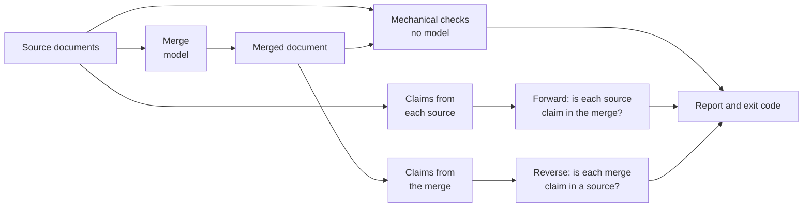

# LLossless

**Merge documents with AI, then check, claim by claim, that nothing was lost, changed or made up.**

*The name is LLM plus lossless: a merge written by a large language model that loses nothing, or tells you exactly what it lost.*

Teams often keep the same knowledge in more than one place: two runbooks for one fault, a policy and the team copy that drifted away from it, knowledge-base articles that say almost the same thing. A language model will merge them into one clean document in seconds, and that is the problem: the result reads well even where it is wrong. A dropped sentence leaves no gap. A value picked from two that disagreed looks decided. An invented detail is written in the same confident voice as the real ones. LLossless merges your documents and then holds the result against every source, in both directions: every fact in a source must survive into the merge, and every fact in the merge must come from a source. Each problem comes back with a quote and a line number, and the exit code stops a pipeline from publishing the merge. The check cannot be turned off.

[A real example](#a-real-example) · [What you get](#what-you-get) · [What to expect](#what-to-expect) · [Which model](#which-model-to-use) · [Try it](#try-it-in-two-minutes) · [How it works](#how-it-works) · [Lessons learned](#lessons-learned) · [Documentation](#documentation)

<picture>
  <source media="(prefers-color-scheme: dark)" srcset="https://github.com/user-attachments/assets/6d9ce6f1-dddf-4da8-acbc-3ec2d592f0b6">
  
</picture>

*The web interface after a run with findings. The answers in this screenshot came from a scripted test endpoint (`test-model`), not from a real model.*

## A real example

**One of the strongest models we tested made a silent decision for your team.**

Two runbooks cover the same fault. The field crew's says: send a jammed dock to the workshop after **2** failed attempts. The support desk's says after **3**. They disagree, and someone should decide which is right.

Claude Opus 5.5 was asked to merge them. The result reads perfectly and says 2. The 3 is gone, and nothing in the merged document shows the two teams ever disagreed. The next person to read it follows a rule nobody actually agreed on.

LLossless caught it:

<!-- verbatim: arms/2026-09-27/lineup/cells/opus-5.5-api/S1/bike_docks/d1/a1/stderr.log -->
```text
LLossless merge  claude-opus-5-5 at https://api.anthropic.com, window 200,000 (stated)
...
Finished, with problems. The report lists what was found.
  1 partly dropped: the merge carries some of this claim (see `## Findings`)
  3 contradicted: the merge states something different (see `## Findings`)
...
  the full report went to stdout; exit code 1
```

- **It names the conflict and shows both sides,** each with its file and line number.
- **It fails the build.** Exit code 1 stops a pipeline before the merge is published.
- **It took 105 seconds and cost about 35 cents.**

It wasn't a fluke: 7 of the 8 model runs on this pair, five models across API and subscription routes, did the same. Only Haiku 4.5 through the API kept both numbers.

**If your teams merge runbooks, policies or knowledge-base articles with AI, the dangerous errors are the ones that read well.** LLossless makes every merge auditable: whatever it finds dropped, changed or invented comes back as a finding you can check, with the quote and the line.

<details>
<summary><b>The details:</b> the two sources, the merge and the report, quoted from the run</summary>

The two runbooks are public test pairs in [`tests/pairs/bike_docks/`](tests/pairs/bike_docks/). The field crew's, `source_a.md`:

<!-- verbatim: tests/pairs/bike_docks/source_a.md -->
```markdown
Escalate E2 to the workshop after 2 failed attempts. Do not keep cycling a dock
that has failed twice; repeated forcing bends the pin and turns a 20 minute
workshop job into a replacement.
```

The support desk's, `source_b.md`:

<!-- verbatim: tests/pairs/bike_docks/source_b.md -->
```markdown
Raise an E2 to the field crew. If the field crew have already tried 3 times,
raise it to the workshop instead.
```

The command, with Claude Opus 5.5 through the Anthropic API doing the merge and all the checks, at fidelity `high` and full verification (the defaults) and with reasoning on for all three roles:

```sh
llossless merge source_a.md source_b.md --base source_a.md -o merged.md > report.md
```

The merged document keeps the field crew's 2 and says nothing of the 3:

<!-- verbatim: arms/2026-09-27/lineup/cells/opus-5.5-api/S1/bike_docks/d1/a1/merged.md -->
```markdown
## When to escalate E2

The support desk raises an E2 to the field crew. Escalate E2 to the workshop after 2 failed attempts. Do not keep cycling a dock that has failed twice; repeated forcing bends the pin and turns a 20 minute workshop job into a replacement.
```

The report names it from both directions. `B-008` is a claim from the support desk's runbook that the merge contradicts; `M-014` is a claim in the merge that states as settled what the sources dispute:

<!-- verbatim: arms/2026-09-27/lineup/cells/opus-5.5-api/S1/bike_docks/d1/a1/report.md -->
```markdown
- **B-008** -- the two documents disagree
  - `source_b.md:15` says: If the field crew have already tried 3 times on an E2 fault, the fault is raised to the workshop instead.
  - `merged.md` says: 'Escalate E2 to the workshop after 2 failed attempts.' (grounded)
...
- **M-014** -- the two documents disagree
  - `merged.md:17` says: E2 is escalated to the workshop after 2 failed attempts.
...
  - why this was read as a contradiction: Source A says 2 failed attempts but source B says 3, and the claim states 2 without reporting the disagreement.
```

The other two findings are smaller cases of the same thing: the merge blurred who takes a station out of service and who issues refunds. This is one run, made on 2026-09-27 for the release benchmark (7 calls, 105 seconds, about $0.35). The whole run, with the full report and the merged document, is in [`arms/2026-09-27/lineup/cells/opus-5.5-api/S1/bike_docks/d1/a1/`](arms/2026-09-27/lineup/cells/opus-5.5-api/S1/bike_docks/d1/a1/), and [Reading the report](docs/report.md) tours every section.

</details>

## What you get

A merge you can trust has to answer three questions:

1. Did every fact survive?
2. Did anything change?
3. Did anything appear that no source says?

LLossless answers each one with evidence.

- **A merge or a check.** It merges two or more Markdown or plain-text documents with the model you choose, or checks an existing merge, however it was made.
- **Checks that verbatim data is retained.** Numbers, units, URLs, file paths, versions, commands and code blocks must survive unchanged, and every source sentence must be present or accounted for. These are plain string comparisons, so anyone can verify a finding by hand.
- **Checks of meaning, in both directions.** The sources and the merge are split into short factual claims, so-called atomic claims. Each source claim is looked for in the merge: was it **dropped** or **contradicted**? Each merge claim is looked for in the sources: was it **invented**? Every verdict has to quote its evidence, and a quote that is not in the file it names is flagged.
- **A report you can audit.** A verdict, the counts behind it, each finding with its evidence, what happened to every claim, and which model, settings and prompts produced it. The exit code tells a script what happened.
- **A choice of how freely it may reword**, from copying sentences verbatim to editing like a careful human editor, while numbers, links and code stay protected at every level.
- **It runs on your machine**, with your own local model, API keys or Claude subscription, from the command line or a web interface. It has no telemetry, and nothing leaves the machine except the calls to the model you configured (and, at fidelity level `sourced`, that model's own web searches).

## What to expect

**It finds what it is built to find.** On the 13 pre-registered test documents, each a merge with a known defect or none, the full check found 7 of 7 planted defects and wrongly flagged 0 of 116 correct statements it graded (one model, one run). The cheaper `coverage` depth found 6 of the 6 defects it can reach and ran 2.04x faster.

**Models do lose things.** On the nine public document pairs in the 2026-09-27 release run, every model deviated from a careful hand-written merge, and 5 of the 8 rows lost content without declaring it. Those are the losses a reader of the merged document cannot see.

**Cost and time.** On those pairs, each source under 6 KB, one merge with all its checks cost $0.012 to $0.485 through a vendor API and took 69 to 332 seconds; through a subscription CLI it took 164 to 677 seconds, at an API-equivalent $0.309 to $0.614 per merge, the price of the same calls, not money spent. A local model costs nothing per call and runs at the speed of your hardware. Longer documents cost more, because every document gets its own calls and verification is paid per batch of claims.

**What it does not do:**

- **It checks facts, not writing.** LLossless does not evaluate writing quality, so a merge that reads badly passes, and rewording or reordering within what the fidelity level allows is silent. Numbers are different: in a merge the tool made they must survive exactly, so "512" rewritten as "0x200" is a finding, and so is "approximately 500".
- **Long documents are checked more coarsely.** Claims get bigger as documents get longer, and one claim that bundles three facts can hide a dropped one. [Measured, not yet fixed](docs/results.md#known-limitation-claims-coarsen-as-documents-get-longer).
- **It is for prose, not source code.** Code inside fenced blocks in a document is protected; whole source files are not. Do not use it to merge code.
- **It does not decide what belongs together.** It merges unrelated documents if asked. In the one measured case, the declared-loss budget made that run fail loudly.
- **Two sources are what has been measured.** Up to twelve are accepted and checked, but almost every published figure comes from a pair: the one exception is the three-source `mahjongg` control document in the benchmark.
- **The checker is a model too.** Its verdicts must quote real evidence, which catches a fabricated quote but not every wrong judgement. Temperature 0 and a fixed seed do not make the model deterministic, and claim extraction varies a little between runs.
- **The evidence base is small**: short hand-written test documents, mostly English, and mostly one run per cell.

[Measured results](docs/results.md) has the figures behind all of this, including where the project's own headline metric misleads.

## Which model to use

Which model should you trust with a merge? Price and reputation do not answer that; measuring does. Because most of its checks are computed by code, LLossless doubles as a benchmark: the same documents through every model, scored the same way. A model that silently loses content is disqualified before anything is ranked, and a merge made by a script with no model in it is scored beside every model, so you can see whether a model beat a script. [The benchmark](docs/benchmark.md) has the full rules.

### Results, 2026-09-27

Nine merge pairs at `high`, two documents with planted factual errors and one clean control document at `open`, 295 runs. The registration, every report and the figures are in [`arms/2026-09-27/lineup/`](arms/2026-09-27/lineup/figures.md).


| Model, route | Silent loss, 9 pairs | Deviations per pair | Planted errors fixed, voyager (of 44) | bip39 (of 14) | $ per merge |
|---|---|---|---|---|---|
| GPT-6 Sol, API | 0 | 4.11 | 23 | 11 | 0.19 |
| GPT-6 Luna, API | 2 | 5.67 | 19 | 8 | 0.01 |
| Opus 5.5, API | 2 | 6.78 | 29 | 13 | 0.49 |
| Opus 5.5, subscription | 0 | 7.00 | 32 | 13 | 0.61 |
| Sonnet 5, API | 0 | 8.11 | 21 | 12 | 0.46 |
| Sonnet 5, subscription | 5 | 7.33 | 20 | 12 | 0.31 |
| Haiku 4.5, API | 13 | 6.25 | 11 | 8 | 0.07 |
| Haiku 4.5, subscription | 3 | 7.56 | 6 | 8 | 0.48 |
| *Mechanical union, no model* | 0 | 7.78 | - | - | - |

**How to read the columns:**

- **Silent loss** (lower is better, and only 0 is good enough): sentences from the sources that are missing from the merge, and that the merge never said it left out. These are the losses a reader cannot see. Any silent loss puts a model out of the ranking. Each one is a failure of the model, and LLossless reported it.
- **Deviations per pair** (lower is better): how far the merge is from a careful hand-written merge of the same two documents. It counts sentences the merge should have kept but did not, sentences it should have left out but kept, and sentences it repeated. The last row shows what a simple program scores by pasting the documents together without duplicates: a model at or above 7.78 did no better than that.
- **Planted errors fixed** (higher is better): each of these documents has known factual errors planted in it, 44 in voyager and 14 in bip39, and the merge was allowed to correct facts. The number is how many it corrected. Only the fidelity levels `open` and `sourced` allow the model to correct facts, so these runs used `open`. At the lower levels the merge carries such errors over unchanged.
- **$ per merge** (lower is better): the price of one merge including all its checks.

Planted errors are the median of three runs. Subscription dollars are the API price of the same calls, not money spent.

**Which model for what:**

- **Merging with little loss at a low price: GPT-6 Sol.** No silent loss under the ranking rule, the fewest deviations of any model and well below the mechanical union, at 19 cents a merge. One of its three runs of the largest pair lost one fact silently.
- **Fixing factual errors in the sources: Opus 5.5.** It fixed the most planted errors on both routes. Its API row lost two facts silently in one of three runs of the largest pair. Fable 5.1, tested on the subscription only and on the three documents Opus found hardest, fixed 38 of 44 on voyager, more than any Opus run, at about 2.3 times Opus's cost.
- **The sweet spot: no model leads on all three.** Opus 5.5 on the subscription comes closest: no silent loss in any run, the most errors fixed, and fewer deviations than the mechanical union, at the highest cost per merge. When cost matters more than fixes, GPT-6 Sol is the cheaper corner.
- **Checking a merge: Sonnet 5.** In the detection tests it was the only model that got all 13 outcomes right, with nothing invented, on both routes. As a merger on the API it did no better than the mechanical union.
- **Sonnet 5.5: not measured.** It was released after this benchmark and thinks by default; how it performs in LLossless has not been tested.
- **On a tight budget: GPT-6 Luna**, at about one cent a merge, with two silent losses on nine pairs.
- **Skip: Haiku 4.5.** The most silent losses, the fewest fixes and two outright failures, and on the subscription it takes over eleven minutes a merge.
- **Local models: not measured in this release.** An earlier trial with an 8B and a 27B model was stopped: the 8B was not useful, and the 27B cost more to run than a hosted frontier model for a result expected to be worse, on top of serving problems with Ollama and vLLM. Even the weakest hosted model here is not fit for production work, so a local model would have to match the stronger ones above, and this benchmark cannot tell you which one does.

Most pairs ran once, and a single run can move a model by several facts. Gemini 3.8 Flash was registered but not measured: its free tier answered "high demand" throughout. [`arms/BENCHMARK-MATRIX.md`](arms/BENCHMARK-MATRIX.md) lists every earlier measurement with its settings and caveats.

## Try it in two minutes

### Install

Python 3.11 or newer. Zero runtime dependencies: the HTTP client is `urllib.request` from the standard library.

```sh
git clone https://github.com/toby-sutor/LLossless/ llossless
cd llossless
uv sync
uv run llossless --help
```

`uv sync` creates a private environment in the folder and installs LLossless into it, so nothing touches your system Python. The examples below write `llossless`; run them as `uv run llossless`.

**Without installing anything.** From the cloned folder, Python can run it directly:

```sh
PYTHONPATH=src python3 -m llossless --help
```

### The web interface: the fastest way to results

```sh
llossless serve
```

Or, without installing:

```sh
PYTHONPATH=src python3 -m llossless serve
```

The first start prints a one-time address. Open it, create the first account, paste an API key (from OpenAI or Anthropic, for example) or switch on a detected `claude` route, then drop in two or more documents and press **Merge and check**. The page shows each step as it runs and ends on the report, with the merged document, the HTML report and a zip of everything for download. It listens on `127.0.0.1` port `8765` only unless told otherwise via `--port` and `--host`. It adds accounts with their own keys, a model picker with measured cost, speed and loss figures, a run queue that survives a restart, and English and German pages; uploaded documents are deleted 48 hours after a run by default. [The web interface](docs/web.md) documents all of it, including the JSON API.

### Or the command line: pick a model

**Not sure where to start? Let the web interface write the command for you.** Set up a run on the page, and after it starts, open **Run this from the command line**: it shows the exact command that run used, with a **Copy command** button, ready to repeat or automate. Your API key is never shown in it.

LLossless has three roles:

- `merge` writes the merged document,
- `decompose` splits documents into claims, and
- `verify` checks them.

Each can use a different model and endpoint, so an expensive model can write the merge while a cheaper or local one does the checking. Pick one of three routes.

**A vendor API.** Point it at the vendor's OpenAI-compatible address, choose the request profile, state the model's context window and supply a key. The key is read at send time and never written to a report, a log or the cache, and it is never sent over plain `http://` to another machine.

```sh
export LLOSSLESS_BASE_URL=https://api.anthropic.com/v1
export LLOSSLESS_PROFILE=anthropic                # or openai-reasoning, google
export LLOSSLESS_WINDOW=200000                    # the model's context window
export LLOSSLESS_THINKING=decompose,merge,verify  # frontier models were measured with reasoning on
export LLOSSLESS_API_KEY=...                      # or name another variable in LLOSSLESS_API_KEY_ENV
```

**A Claude subscription.** LLossless can answer through the `claude` command line instead of a metered API. The web interface finds an installed `claude` and switches it on with one toggle; on the command line it is `--answer-with` and a few variables, listed in the [reference](docs/reference.md#answering-through-a-program). Subscription runs are not priced per call, and they are not reproducible run to run, because they do not allow setting a seed or temperature. For most uses, that is fine.

**A local model (the default).** The default endpoint is a local Ollama at `http://localhost:11434/v1`: copy `models.local.example.json` to `models.local.json` and name your model, as in `{ "merge": "qwen3:8b", "verify": "qwen3:8b" }`. Start Ollama with `OLLAMA_CONTEXT_LENGTH=32768` or more, because a merge needs more context than its default. A local model is the default because it needs no key, not because it merges well: see [the benchmark results](#results-2026-09-27) before relying on one.

### Merge two documents, or check a merge you already have

```sh
llossless merge notes-a.md notes-b.md --base notes-a.md -o merged.md > report.md
llossless verify notes-a.md notes-b.md merged.md > report.md
```

`merge` writes the merged document to `-o` and the report to stdout; `--base` names the document whose structure the merge follows. `verify` makes no merge call, so it is the cheaper of the two. Add `-v` to watch each step, `--dry-run` to count the calls before spending anything, or `--html report.html` for the report as one self-contained page.

### Full run example

A full run on the command line looks like this:

```sh
export LLOSSLESS_API_KEY='<your OpenAI API key>'

llossless merge chris_birthday_1.md chris_birthday_2.md --base chris_birthday_1.md \
--base-url https://api.openai.com/v1 --model gpt-6-luna --window 200000 --fidelity open \
--verify-depth full --title-policy synthesise --loss-budget 0.03 --profile openai-reasoning \
--thinking merge --thinking decompose --thinking verify -o merged.md > report.md
```

### The settings that matter

- **Fidelity, how freely the merge may reword:**
  - `verbatim`: does no editing at all, and in most scenarios simply concatenates the documents.
  - `low`: also fixes spelling, grammar slips and punctuation. Where two documents disagree, both statements stay.
  - `mid`: also rewrites single sentences for clarity, and may fold a short detail into the sentence it belongs to. Every folded detail is listed in the report, and disagreements still keep both statements.
  - `high` (default): rewrites freely, like a careful editor: states a repeated point once, joins facts from both documents into one statement, and settles a disagreement by choosing one value, saying which and why. That choice is the model's judgement, so check it.
  - `open`: everything `high` does, and the merge may also correct a fact from what the model knows, or give a range that covers two figures your documents disagree about. The result can then say things your documents do not, so such a correction rests on the model's word.
  - `sourced`: like `open`, but the model is asked to look facts up on the web instead of recalling them, and the report says whether it did. Text from your documents can leave the machine in a search, and it needs a route that is allowed to search the web.

  At every level, numbers, units, URLs, paths, versions, commands and code blocks must survive exactly, and whatever the merge chose not to carry over it has to declare. [The six levels in full](docs/reference.md#fidelity).

- **Verification depth:**
  - `full`, the default, checks both directions.
  - `coverage` skips the reverse pass: cheaper, and it can never catch an invention.

- **Models and routes:** any OpenAI-compatible endpoint works, including Ollama, vLLM and the Anthropic, OpenAI and Google APIs, and each role can have its own ([one endpoint per role](docs/reference.md#one-endpoint-per-role)).

- **Exit codes:**
  - `0` nothing found
  - `1` a problem in the merged document
  - `3` the document is sound, but the merge misdescribed what it did
  - `2` the run could not finish

  A run that could not check everything never passes. [Exit codes in full](docs/reference.md#exit-codes).

Every flag and variable is in the [command-line reference](docs/reference.md).

## How it works

A plain AI merge cannot be trusted for one reason: the only witness to what happened is the model that did it, and a model asked to check its own merge will happily confirm that what it dropped was meant to be dropped. So LLossless never takes the model's word. First, everything that can be checked by comparing strings is checked that way, with no model involved: a changed number, a link that lost a character, a re-indented code block, a source sentence that vanished without a record. Then a model splits the sources and the merge into short claims and grades them in both directions, and every verdict has to quote its evidence from the file it names, or the bad quote is reported beside the verdict. The merge must declare everything it chose not to carry over, a declaration counts only when the forward check independently finds the content gone, and past `3%` of the source the volume of declared drops is itself a finding. Every report records which model, settings and prompts produced it, and the test suite replays recorded model answers offline, so a changed prompt cannot pass quietly.



[How it works](docs/how-it-works.md) has the pipeline step by step, the checks that do not take the model's word, structured output, testing and the design principles. `python3 tests/run_all.py` runs every test, and the suite needs no model.

## Lessons learned

LLossless started in March 2026 as a question: when a large language model (LLM) merges two knowledge-base articles, what does it leave out? It was built in milestones, each ending in a written review. A few of the things it taught:

- **Reading finds the loud errors, and a diff finds the quiet ones.** The answer key for a document with planted factual errors was first typed by reading two versions side by side; a word diff found about twice as many, the swapped words and decimal commas a model carries through unnoticed.
- **A script can beat a model.** A mechanical union, one document plus every paragraph of the other that it does not already contain, deviated from the hand-written reference merges less than one frontier model's run did. So the benchmark scores it beside every model.
- **A gap between models can be a gap in the prompt.** Two models deleted internal markup tags that two others kept, which looked like a ranking. Three sentences saying that tags are code closed the gap completely.
- **Show the model the shape.** Merged code came back with its indentation destroyed, and the model looked guilty, but the pipeline had stripped the indentation before the model ever saw it. Restoring it fixed the indentation and, unexpectedly, stopped the model from collapsing two programs into one.
- **The models moved faster than the project.** During development two model families released a new generation, and one model began refusing the merge prompt through its API. So the lineup is frozen per release, every figure is dated, and re-measuring is cheap.
- **Open-weight models are not cheaper.** Initially, the idea was to build this application against open-weight models such as Qwen or gpt-oss-20b. However, the local 8 GB VRAM card was insufficient for most models and the required context. So a hosted/serverless GPU route was chosen where bigger cards, such as 24/48/80 GB VRAM cards could be rented by the minute. Those models failed for most scenarios and the money spent hosting them quickly outran a Claude subscription or OpenAI tokens.

## About the author

LLossless is designed and maintained by [**Toby Sutor**](https://www.linkedin.com/in/tobysu/).

It was built by one person working with AI coding agents. The code, tests and documentation were written by Claude, through Claude Code, under the author's direction: the author set the goals and the quality bar, made the design rulings, reviewed the results, and caught much of what the agents missed. This is stated openly because it bears on what the tool is for: a tool built on the rule that a language model's output must be checked, not trusted, was itself built by checking a language model's output, and several of the lessons above come from doing that.

## Status and contributing

Version 0.1.0, the first public release. The tool works end to end and is tested, and the first cross-vendor benchmark results are above. Bug reports and questions are welcome as issues.

## Licence

Elastic-2.0, the Elastic License 2.0, with the text in `LICENSE`. It is source-available rather than OSI open-source: you may use, modify and redistribute the code, and you may not offer it to third parties as a hosted or managed service.

If you are interested in a commercial licence that allows hosted or managed services, please contact the author directly.

Four directories are excluded from this licence. The fixture corpora in `tests/pairs/`, the hand-written document pairs in `tests/handwritten/`, the raw model-study outputs in `arms/` and the annotated pages in `annotated/` are under Creative Commons Attribution 4.0 International, which permits commercial use. Each carries its own `LICENSE`, and that file governs its directory rather than this one. One exception inside them: four document sets in `tests/handwritten/` are adapted from Wikipedia articles, and they and the benchmark runs that merged one of them are under Creative Commons Attribution-ShareAlike 4.0 International, which also permits commercial use and requires anything built from them to carry the same licence. `NOTICE` lists them. [How it works](docs/how-it-works.md#licence) says where the licence text and the copyright notice live.

## Documentation

| page | what is in it |
|---|---|
| [Command-line reference](docs/reference.md) | every command, flag and variable; fidelity levels and exit codes in full; the cache; the context ceiling |
| [The web interface](docs/web.md) | accounts, keys, routes, the model picker, retention, the JSON API |
| [Reading the report](docs/report.md) | a tour of every report section |
| [Measured results](docs/results.md) | the recorded evidence, its limits, and the reference configuration |
| [How it works](docs/how-it-works.md) | the pipeline, verdicts, design principles, non-goals, the repository map, testing |
| [The benchmark](docs/benchmark.md) | how models are compared, and the fairness rules |
| [Benchmark specification](docs/bench-spec.md) | the first frozen specification and property registry |
| [Benchmark matrix](arms/BENCHMARK-MATRIX.md) | every model measurement so far, with settings and evidence |
