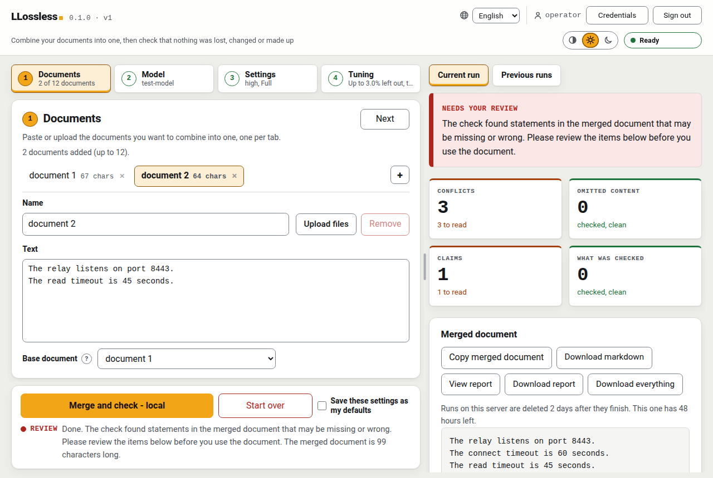

# The web interface

`llossless serve` puts the same merge and the same checks behind a small web page on your own machine: drop in documents, pick a model, watch the run, read the report. This page is the full reference for it, for the person running the server and for anyone scripting against its API. The [README](../README.md) has the short version, and the [command-line reference](reference.md) covers the settings both share.



*A finished run with findings. The answers in this screenshot came from a scripted test endpoint, not from a real model.*

- [Starting the server](#starting-the-server)
- [Accounts and signing in](#accounts-and-signing-in), [whose key a run uses](#whose-key-a-run-uses), [who can see a run](#who-can-see-a-run)
- [API keys and endpoints](#api-keys-and-endpoints)
- [Choosing a model](#choosing-a-model), [the picker and the scorecard](#the-model-picker-and-the-scorecard), [models an endpoint serves](#models-an-endpoint-serves)
- [Subscription command routes](#subscription-command-routes)
- [Runs](#runs)
- [Languages](#languages)
- [Retention](#retention)
- [What a submitted form may choose](#what-a-submitted-form-may-choose)
- [The JSON API](#the-json-api)

## Starting the server

`llossless serve` runs the same two commands behind a small HTTP server on this machine. It exists because a merge takes between 23 seconds and 76 minutes over the runs recorded here, which no request can hold open: the browser submits documents, gets a run id back, and watches the run on a Server-Sent Events stream. The merge itself is the pipeline `llossless merge` runs, against the endpoint this server's own environment configures, and a test holds one merge through each path against the same endpoint and requires the two reports to agree.

| flag | what it does |
|---|---|
| `--port PORT` | listen on this port (default 8765). `0` asks the operating system for a free one and prints what it gave |
| `--host HOST` | listen on this address (default `127.0.0.1`). Anything that is not loopback needs either an account or a token in `LLOSSLESS_WEB_TOKEN`; the token is consulted only while the server has no accounts |
| `--work-dir DIR` | where submitted documents and their reports are kept until the retention window passes (default: a `web` directory under the cache directory). Created owner-only |
| `--workers N` | how many merges may run at once (default 1). The engine is synchronous and `--min-interval` paces one client, not a pool |
| `--retention SECONDS` | delete a finished run's documents, merge and report this long after it finishes (default 172800, which is 48 hours). `0` keeps them until they are deleted, across restarts |

## Accounts and signing in

**The first start prints a one-time address, and nothing else answers until it has been used.** A server with no accounts is a server in setup: every route but the login one refuses, and the line on stderr carries a URL whose fragment holds a token from `secrets`. Opening it once creates the first account, which is the operator's. The address stops working the moment that account exists, and a new one is generated on every start. There is no default password, because the password that has not been changed yet is the one a scanner finds. Whatever is already in the credentials file becomes that first account's, and from there it is the set of endpoints every later account shares.

| variable | what it does |
|---|---|
| `LLOSSLESS_ACCOUNTS` | where the accounts file lives (default `$XDG_CONFIG_HOME/llossless/accounts.json`) |
| `LLOSSLESS_CREDENTIALS` | where the operator's shared credentials file lives |
| `LLOSSLESS_WEB_TOKEN` | a bind token, consulted only while this server has no accounts |
| `LLOSSLESS_RETENTION` | the retention window in seconds, for a deployment configured by environment rather than by command line. `--retention` beats it; `0` keeps runs until they are deleted |
| `LLOSSLESS_COMMANDS` | where the command-route file lives (default `$XDG_CONFIG_HOME/llossless/commands.json`). Absent is the default and means this server offers no command backend until one is written there, by hand or by the credentials sheet's toggle |

Operators can add and remove accounts and reset a password; anybody can change their own, and doing so ends every session that account had, including the one that asked. Sessions live in the server process and go when it stops, so a restart signs everybody out. The runs do not: see [the queue survives a restart](#runs).

**Before you give someone an account: they can spend your money.** A member who has not set up their own endpoint for a provider runs on the operator's endpoint, with the operator's key, and so on the operator's credit. There is no spending limit per account, and the only thing that is rate-limited is the login. Anyone who can sign in can therefore spend as much as the operator's key allows. Only give an account to someone you would trust with shell access to the server. [Whose key a run uses](#whose-key-a-run-uses) has the details.

### How a request is authenticated

**Signing in is what authenticates a request**, per person rather than per server. The session id comes from `secrets.token_urlsafe`, is held server-side and compared with `hmac.compare_digest`, and reaches a browser as a cookie that is `HttpOnly`, `SameSite=Strict` and `Path=/`, and `Secure` as well when the request reached the front of the deployment over TLS. `SameSite=Strict` is the defence against cross-site request forgery: a cross-site navigation or form post arrives with no cookie at all, and the `Origin` check on every mutating request stays in place as a second layer. A script presents the same session id in an `X-LLossless-Token` header, which is also the header a token-protected deployment uses.

Passwords are hashed with `hashlib.scrypt` where the build offers it and `hashlib.pbkdf2_hmac` where it does not, with a per-user salt from `secrets` and the cost written into the record, so the cost can be raised later without invalidating the accounts already in the file. An unknown username and a wrong password produce the same status, the same code, the same sentence and the same order of duration: the derivation runs either way, against a decoy when the name is not there, because a login that returns early on an unknown name reveals which usernames exist to anyone with a stopwatch.

**`--host` with anything that is not loopback needs either an account or a token.** The server spends a credential on every document submitted to it, so reaching it from another machine and authenticating the submitter are one decision and not two. With no accounts that is `LLOSSLESS_WEB_TOKEN` naming a secret of at least 16 characters, refused before the socket is bound rather than after. With at least one account, logging in *is* that authentication and the token is not consulted at all: a script still presenting it gets a 401 naming the login route, and the startup banner says so where one is set. Keeping one secret, not two in parallel, avoids a superseded one staying configured for years.

The page itself is served to anybody who can reach the port, and it is a shell: every byte of state on it (the catalogue, the limits, the endpoints, the runs, the reports) arrives through a route behind the check above. The routes that answer without an identity are `session`, `setup` and `locales`, and that list is an allowlist of exact path segments rather than a prefix. A server bound to loopback also refuses any request whose `Host` header is not loopback, which guards against DNS rebinding; a server bound to a network address does not, because a deployment reached over a network is reached by some name.

### Whose key a run uses

**A run uses the key of the person who submitted it.** If two people run at the same time, each run spends its own submitter's key, and neither can see the other's. Only the operator's keys are placed in the server's environment, and no key is ever part of anything the server prints or writes out as JSON. (For contributors: `config.keys_for_this_run` sets where `Settings.api_key` reads from, for the worker thread that runs the job.)

There are two kinds of endpoint:

- **The operator's.** Set up once and shared with every account. Only the operator can change it.
- **Your own.** Private to your account. For your runs it replaces the operator's endpoint for that provider, and it uses your key.

So a member with no endpoint of their own for a provider runs on the operator's, and a member who has one runs on theirs. A key can only be stored together with an endpoint address of your own. The reason: a key saved without an address would be sent to whichever address happens to be in effect, which may not be one you chose.

### Who can see a run

**Only the person who submitted a run can see it.** That covers the list of runs, a run's status, its report, the merged document, the live progress stream and deleting it. A request for somebody else's run gets exactly the answer a run that does not exist gets. Knowing a run's id is not enough to open it: an id shows up in the address bar, in browser history and in links pasted into a chat, so it is not treated as a secret.

## API keys and endpoints

**Anthropic, OpenAI and Google come with their usual address filled in** (`https://api.anthropic.com/v1`, `https://api.openai.com/v1`, `https://generativelanguage.googleapis.com/v1beta/openai`), so on a fresh server you only paste a key. Saving the key saves that address first, as an ordinary stored value, and the key is bound to it; "Change address" opens the field for a proxy or a regional endpoint. An address you already stored is never replaced, and changing one clears the key that was bound to the old one.

**API keys set through the settings page live in a file of their own.** It is `$XDG_CONFIG_HOME/llossless/credentials.json`, or `~/.config/...` where that variable is unset, or wherever `LLOSSLESS_CREDENTIALS` names. The file is `0600` inside a `0700` directory, written through a temporary file that is `0600` before a byte of it is written, and a file whose mode is wider than that is **refused** rather than quietly repaired: every account on the machine has already had the chance to read it, so the keys in it want rotating. The server loads the file into its own environment under the variable each provider's key is read from, and no endpoint ever returns a key. The settings endpoints answer with the variable name, whether something is configured, and the last four characters.

**An endpoint is stored beside the key it is paired with, and changing one clears the other.** The same file holds a base URL per provider, set on the same settings sheet and freely editable. Saving a provider's endpoint clears whatever key was stored for that provider, deliberately: moving an endpoint without noticing that the previous provider's key is still attached would send a real credential to a host typed in thirty seconds ago, and `Endpoint.moved_to` is the only way an address changes, so there is no call that keeps one. A URL carrying a username or password is refused rather than stripped; the key goes in the key field. The same two guards a run's own endpoint gets apply here: a scheme that is not http(s) is refused, because `urllib` would otherwise read a `file://` URL as a model answer, and a cleartext `http://` endpoint off this machine is refused while a key for that provider is set.

**The credentials sheet has no draft state.** A key, an endpoint, an account or a toggle saves the moment you use its own control, row by row, and closing the sheet keeps what was saved and drops whatever was typed and never saved.

## Choosing a model

**A model is sent to the endpoint stored for its provider and to nowhere else.** So the picker lists only what can run here: a catalogue model whose provider has an endpoint configured, a model an endpoint listed, and the command routes this server offers. A model with no endpoint is not offered, so it cannot be submitted and fail two steps into a run; the scorecard below still lists it, with the reason beside it. With nothing configured the picker says so and points at the credentials sheet. A model id typed into the free-text field goes to this server's own endpoint, or to whichever configured endpoint the control beside it names: a provider name, never an address.

The status line beside the button says "more input needed" in amber, with what is missing ("Add at least 2 documents to merge.", "Nothing is in document 2 yet."), or "ready" in green, and the button is enabled exactly when it says ready.

### The model picker and the scorecard

**The picker is one list and every row is a route to a model.** `Claude Haiku 4.5` and `Claude Code - Haiku` are two rows, each badged with what it is (metered API, subscription, local) rather than one model with a toggle beside it, because a toggle is a second piece of state to misread. Each row's badge names its route: "subscription" and "command on this server" in blue, "metered API" in amber, "local" in grey, and "route not identified" in grey with a dashed border. An address is classified by the server: loopback, private, link-local and the reserved `localhost` names are local, anything it cannot place reads as metered, and nothing to classify reads as unidentified. Where both exist, the subscription is preselected: firing at a metered API when you meant the plan costs money, and the reverse costs a run against a plan you already pay for.

**The submit button names the route it is about to take** (`Merge and check - subscription`), since the click is the irreversible moment. **Every** route names itself there, including `local` for an endpoint on this network and `route not identified` for a selection the page cannot classify: a label that appeared for some routes and not others would teach a reader that its absence means nothing in particular.

**Every figure is on the main page; every model, its notes and its dates are in the Model scorecard, one click away.** The picker keeps four bands per row (cost per merge, seconds per merge, silent loss and deviations per test) as a band and a word, with no raw number, so the row stays one line. Its four headers are one word each (Cost, Speed, Loss, Deviations), so a longer language (German's "Kosten", "Tempo", "Verlust", "Abweichungen") never squeezes the model name; a small "?" beside each explains the unit and the full meaning in plain language on hover and on keyboard focus.

The "Model scorecard" button beside the table opens a dialog with every catalogue model and route, configured here or not: the same four figures, under their longer, precise headers ("Cost / merge", "Seconds / merge", "Silent loss", "Deviations / test"), with their raw numbers and the test count each rate was formed over, each row's measured date, its catalogue notes behind a fold (English, and marked so on a page in any other language, since they are a measurement record rather than page prose), a retired row, when there is one, dimmed with its reason, and "About this list".

**Sorting.** Each column heading sorts, ascending and then descending, on the picker and the scorecard independently; the default is the catalogue's order. A row with no figure in that column (unmeasured, `on plan`, `free tier`, `per GPU-minute`) sorts last in both directions and is never read as zero, retired rows sort after every live one, and the silent-loss column sorts by quality: silent loss per test first, deviations per test to break a tie. Sorting never changes the selection. Each table's chosen sort is remembered in this browser, separately.

**A subscription route is marked "not directly comparable"**, with the reason on hover and on keyboard focus: it is told the answer format in the prompt rather than having it enforced, and cannot fix its randomness, so its figures compare with other routes like it, not with rows measured over an endpoint. The marker is a property of the route and does not go away with more runs.

### Models an endpoint serves

**Saving an endpoint asks it what it serves.** The OpenAI-compatible `GET /v1/models` and ollama's `GET /api/tags` are both tried, with a short timeout and no backoff, and whatever comes back is offered in the picker. Those rows are `unmeasured` in every figure column: nobody has run them through this tool, so there is no cost, no duration and no silent-loss figure, and none is estimated from a neighbouring row. An endpoint that will not list is not an error: the page says so and the free-text field still works.

**A typed id sent to a vendor needs its context window stated.** A vendor has no `/api/ps`, so the window cannot be measured there, and a model the catalogue does not know has none on record; LLossless does not guess one. The "Context window (tokens)" field beside the id is required when the id goes to a vendor and the server states no window of its own (the figure is on the vendor's page for the model), and optional for this server's own endpoint or a self-hosted one, where an ollama reports it. The request carries it as `window`, which is `--window` on the command line: a whole number of tokens from 4,096 to 10,000,000, recorded as stated rather than measured. Without one, a vendor-bound id is refused before any call, on the page and by the server, instead of merging and then failing every check.

**The checks can only go where the merge's route goes.** With `Use a different model for the checks` ticked under a metered or local merge, a command row cannot be picked for the checks: one run answers through one command or over HTTP, never both, and the only request a page could build for that pairing would send the route's model name over the merge's route, to the metered API itself where the two share a name. Where the two roles are billed differently the button names both, and a run from the page records how each role was billed under `provenance.endpoint.billed`, printed as the `Route` row of the provenance block on the page and in both reports.

## Subscription command routes

**A flat-rate subscription CLI can answer instead of a metered API, and the browser never names the command.** `--answer-with` is safe on the command line because whoever types a flag already has a shell; a web form that accepted a command and a server that ran it would be remote code execution with a submit button on it. So the operator writes the routes into `$XDG_CONFIG_HOME/llossless/commands.json` (or wherever `LLOSSLESS_COMMANDS` names), a request names one by **id**, and the server supplies the command from its own file. `/api/v1/config` serves the ids and the labels and never the command. An id this server does not have is refused naming the field, never answered some other way.

```json
{
  "version": 1,
  "routes": {
    "opus-sub": {
      "label": "Opus 5 - Subscription",
      "command": "claude --print --output-format json --model opus",
      "window": 200000,
      "model": "opus",
      "envelope": "result",
      "web_tools": []
    }
  }
}
```

**Or switch one on from the credentials sheet, which writes the same file.** The server looks up a small hard-coded table of recognised subscription CLIs on its own `PATH`, and then in the usual per-user install directories (`~/.local/bin`, `/usr/local/bin`, `~/.npm-global/bin`, `/opt/homebrew/bin`), and reports what it found: the label, the id, the model, whether it is installed and whether it is on, and **never the resolved path**. `PATH` answers first and the directories are reached only when it found nothing, because a server's `PATH` is whatever started it (a unit file, a container, a desktop sandbox) and a per-user CLI is usually not on it. What is widened is where a name this build already knows is looked for, never what may be run. A toggle writes the route into the file above, with the command set to the path this server resolved plus the arguments the table lists, and the label taken from the table. A request still carries only an id, and an id that is not in the table is refused before anything is resolved or written, so there is no path by which text from a browser reaches a command line. Only the operator can switch one on, because a command route is shared by every account on the instance. Rows written this way carry `"discovered": true`; the page switches its own rows on and off and refuses to edit or delete one you wrote by hand.

**One tool is several routes, one per model.** A CLI answers with whichever model it defaults to unless it is told otherwise, and relying on that is not a strategy: the default may be the dearest model on the plan and nothing on screen says which it is. So the table declares the models each tool can be told to use and the exact arguments that select them, and discovery emits one route per model: `Claude Code - Haiku` and `Claude Code - Opus` are two rows in the picker, and whichever is highlighted is what runs. The rows are ordered cheapest first, and any route you wrote by hand comes before them. An untouched page preselects a route you wrote by hand if there is one, and otherwise the Opus route, the operator's ruling on the 2026-09-25 subscription grid; never Fable, the dearest.

This build recognises `claude` with `haiku`, `sonnet`, `opus` and `fable`. The flag and three of the four aliases come from `claude --help` at version 2.1.274; `haiku` was confirmed from the same binary's string table. A tool or a model it does not know by name is added by writing the route above.

### The fields of a route

- **`label`** is required and is rendered verbatim: nothing here infers which model a program reaches, because guessing that `claude` means Opus 5 is how a correct-looking screen produces a wrong bill.
- **`window`** is required, because a command backend cannot be asked for its context window and there is no token count to check afterwards.
- **`model`** is **required**, and a route without one is refused when the file is read. A command backend cannot be asked which model answered it, so a route that does not say runs on whatever the program defaults to and then reports a name nobody chose. State the model the command selects, and make sure the command really selects it, because nothing here can check that for you.
- **`profile`** defaults to `subscription`.
- **`timeout`** is optional: leave it out and a route gets the command backend's own default of 890 seconds a call; state it in seconds for a program slower than that. It is the one run setting a web submitter cannot pass, since there is no `--timeout` on a form, so a slow route carries its own figure and every run through it gets it.
- **`envelope`** says how the command answers, and defaults to `raw`: standard output is the answer, byte for byte. `result` means standard output is a JSON result envelope, the shape that also carries the token counts (deliberately left unread) and a turn count. The retrieval signal read from it is that turn count (`num_turns`), not the vendor's own server-side web-tool counter, which cannot see this CLI's own tools and reports zero even on a call that fetched. It is declared here and never sniffed: the answer under `raw` is itself JSON at the `prompt` tier, so a sniffer would be choosing between two JSON objects on the presence of a key. **The field and the command have to agree.** A route declaring `result` whose command does not carry `--output-format json` is refused when the file is read, and so is the reverse; otherwise the failure would arrive halfway through a paid run looking like the model's fault.
- **`web_tools`** is which of the model's own retrieval tools the route permits, and defaults to none. `WebSearch` and `WebFetch` are named separately because they carry different risk: this tool's whole input is documents somebody supplied, a document is a place a URL can come from, so `WebFetch` is a path both to exfiltration and to poisoned evidence dressed as a citation. Like `envelope`, the field records what the command's arguments grant and never adds it: listing a tool without `--allowed-tools` in the command is refused. It is a property of the route the operator wrote and never a browser input: a submitter chooses among your routes and never describes one.

### Safe mode for `claude`

**A `claude` route runs the CLI in safe mode, so your personal CLAUDE.md, skills, plugins and MCP servers are not loaded, with only the web tools at `sourced` and no tools at any other level.** Every call through a program named `claude`, a route or `--answer-with`, is started with `--safe-mode` and with `--tools` naming exactly the web tools its arguments grant: `WebSearch,WebFetch` at `sourced`, `""` below it. Without them the CLI loaded the operator's own CLAUDE.md and auto-memory and offered the model its whole tool set whatever `--allowed-tools` said, and one measured merge spawned subagents through it. A `--safe-mode` or `--tools` you write into a route is yours and nothing is appended beside it: a web tool your `--tools` leaves out is not granted, and `sourced` refuses a route whose `--tools` makes none available. A grant in your own `--allowed-tools` stays in force at every level. `--bare` is not used, because it never reads a subscription's login; a wrapper script under another name is started exactly as written, which is the way to run the CLI with your own setup.

### Merge effort on a subscription route

**Merge effort is a slider on a subscription route.** With a `claude` route picked, the page shows a `Merge effort` slider (low, medium, high, extra high, max) set to the route's default (`high` on Opus, `medium` on the others), and a card beside it with what the registered grid measured at that level: planted errors fixed on the two test documents, as the middle of three runs and the range, the licence on the second, time per merge with the checks included, and how often the model searched. The card changes as the slider moves. A level nobody measured says `Not measured at this level` rather than showing a blank or a zero (Haiku at every level but `medium`, Opus 5.5 at every level but `xhigh` and `max`, Fable at every level), and the figures carry their caveat on the card: measured 2026-09-25, before safe mode, three runs per level, on two small test documents. At `low` with `sourced` the card says that level is not recommended for looking facts up.

The figures are `catalogue.json`'s `measured_by_effort` blocks, re-derived from `arms/2026-09-25/subscription-comparison/` by `tests/effort_figures.py --check`; the table's own figures for these routes were measured at merge `medium`, and each row says so. The request carries the level as `effort`, one of `low`, `medium`, `high`, `xhigh` and `max`, and only beside a `command_route` whose program takes `--effort` and whose command names no level of its own; anywhere else it is refused as `400 bad_effort`. `/api/v1/config` serves each route's levels and default. The level goes onto the merge's command line alone, the checks keep `low`, the run header names it, and the report's provenance records it as the requester's choice.

**At `max` the card keeps a cost warning.** On the Opus route it shows one small run of 2026-09-26 on Opus 5.5 in safe mode, asked for by its full id `claude-opus-5-5`: `voyager` only, `xhigh` twice and `max` three times. `max` fixed 38 of 44 (37-38) against `xhigh`'s 38 (38-38), within the spread between runs, and took about 2.2x the time and about 2x the usage. At `max` the card says what was measured in plain words: "No gain over extra high on this test (38 of 44 either way); about 2x the time and usage." They are `catalogue.json`'s `pinned_by_effort` block, re-derived from `arms/2026-09-26/opus-max/` by `tests/opus55_effort_figures.py --check`.

**Opus 5.5 needs Claude Code 2.1.280 or newer.** Version 2.1.274 refuses it: `API Error: 400 Claude Code 2.1.274 does not support this model; version 2.1.280 or newer is required`. The measured run therefore used 2.1.281; the installed CLI it was registered against was 2.1.274, and after `claude update` on the same day it is 2.1.283, which meets the minimum. The server reads the version of each `claude` it runs off the native installer's layout (`~/.local/bin/claude` links to `versions/<version>`) and never by starting the program, and serves it; a CLI installed any other way reads as unknown and is never called too old. A route whose model the CLI is too old for is marked `needs Claude Code 2.1.280 or newer` in the picker, and so is the Opus 5.5 section of the effort card. The route is still offered and still runs: the note says it will be refused, and nothing here checks the model's availability beyond the version.

### What a command row says about itself

Three things a command row says on its face, and each is a limitation rather than a feature. It is **not per-user**: API keys are per account, but a command runs as the server process with that machine's credentials, so everybody on a shared instance shares one subscription and one rate limit. Its figures are **not comparable** with the catalogue's endpoint rows: the `subscription` profile answers at the `prompt` tier through a CLI with its own harness, with no `temperature` and no `seed`, so a run under it is not reproducible by construction. And its cost is **unmeasured, not zero**: LLossless deliberately leaves the envelope's token counts unread, so every call is `unmeasured` and the cost column says it counts against your plan, never `$0.00`, which would read as measured and free.

A command run's provenance says `location: command`, names the route by the operator's label, and reports `content_left_this_machine: true`. That is not a claim that something left: it is that this tool cannot establish that nothing did, because there is no address to classify and a child process that opens a socket opens it unobserved.

**A route that cannot be read takes out itself and nothing else.** The refusal names that route and the field it is missing, the page shows it beside that route, and every other route in the file is still offered and still runs. A route the credentials sheet wrote before this build knew about models (one carrying `"discovered": true` and no `model`) is retired at startup and the page says so once; nothing you wrote by hand is ever touched, whatever state it is in. The only route the API writes is a discovered one, by the toggle above and under the id of a `KNOWN_TOOLS` row. The file is `0600` and a wider one is refused rather than repaired, because another account that can write it is another account choosing what this server executes. **Empty is the default**: with no file and nothing switched on, the page offers no command backend at all.

## Runs

**A running merge can be cancelled.** "Cancel run" sits beside "Stop watching" while a run is followed ("Stop watching" only stops the page following it) and asks first: calls already made are billed and cannot be undone. A cancelled run makes no further model call, abandons an HTTP call in flight (the provider may still bill it), stops a command route's program (SIGTERM, then SIGKILL after 5 seconds), and ends in the `cancelled` state with the report of what ran, which opens "Cancelled." and counts the calls made. `POST /api/v1/runs/<id>/cancel` does the same for a script; only the run's submitter or an operator may cancel it, and anybody else gets the 404 an unknown id gets.

**The queue survives a restart.** Submit several runs, close the tab and come back hours later: the list of earlier runs on the page is where they are, with a queued run's place ("position 2 of 3") updating live and a Follow button to watch it. "Notify me" asks the browser for permission only when clicked, and the notification says "Run finished" or "Run failed" and the run's short id, nothing else.

**A run cut off by a restart is never re-run by itself.** A run that was *running* when the server stopped (a crash, a kill, a power cut) comes back as `interrupted`, because a re-run would make and bill its model calls again. Its entry says the run is not complete, "Show log" replays what reached disk before the stop, and **Retry** starts a new run from the same documents and settings after a confirm step that says it may be billed again (`POST /api/v1/runs/<id>/retry`, submitter only). A failed run can be retried the same way.

**How the queue is kept.** The index of runs is `index.json` in the work directory, rewritten through a synced temporary file and a rename on every change of state, `0600` in the `0700` work directory. On start the server reloads it: queued runs resume in their order, finished runs and their files are listed again, and anything whose retention window passed while the server was down is deleted before anything is served. To make resuming possible, each job directory also holds `sources.json` (the documents as submitted) and `events.jsonl` (the progress log); retention deletes them with the rest. The index holds states, timestamps, the owner's account id, a document count and the run's allowlisted settings, never a document, a filename or a key, and a forgotten run keeps only its tombstone there, for one more window. An index that cannot be read stops `llossless serve` with exit 2 rather than starting with an empty list; moving the file aside is the way out, and the next start then deletes the job directories no index names. A second server on a work directory another one is using is refused.

**Dropping several files makes one document per file**, in drop order, up to the twelve-document ceiling; a file past it, or one that does not decode as text, is refused by name rather than silently dropped, and text already typed into a pane is never overwritten by a drop. Once a run has a report, the actions group orders itself narrow to wide: the copy control first, since it writes nothing to disk, then `View report`, then `Download report` and `Download everything`.

## Languages

**The interface speaks English and German; nothing it produces does.** The page's strings are `src/llossless/web/locales/en.json` and `de.json`, served whole or not at all: a catalogue missing a key is refused rather than filled in from English, because a half-translated page looks translated and nobody reports it. A choice made in the picker is remembered in this browser and beats everything else; with no choice made, `Accept-Language` decides and English is the fallback. Adding a language is adding a file: copy `en.json`, translate the values, and `python3 tests/test_web_i18n.py` will name every key you missed and every placeholder you renamed.

What does **not** change with the language is anything recorded. `report.json`, `merged.md` and `report.html` are byte-identical whoever downloads them, and their identifiers (`silent_loss`, `contradicted`, the finding kinds) stay English everywhere they are written down. Only the *display* of a kind is translated. The command line, its `--help` and both report renderers are English and are not affected by any of this. Neither are the prompts: a prompt is hashed and the digest keys the response cache, so translating one would re-key every recorded run in this repository.

## Retention

**Uploaded documents are deleted by default**, 48 hours after the run that used them finishes: the documents, the merged document, the report, the HTML page and the progress log. Two days rather than one because the window runs from the moment the run finished rather than from the end of a day, so a 24-hour window expires at the hour it started and a run finished on Monday morning is already gone on Tuesday morning. `--retention SECONDS` and `LLOSSLESS_RETENTION` set it, in that order of precedence, and `--retention 0` keeps runs until they are deleted, across restarts. What survives a deletion is a tombstone (an id, a state, three timestamps and an exit code), so a bookmarked run is told it was forgotten rather than being shown a 404 it cannot tell from a typo, and the refusal names the setting so the reader can stop it happening again.

The page says which window it is on before anything is uploaded, warns when a run is inside the last stretch of it (a quarter of the window, capped at four hours, so at the default 48-hour retention the warning starts four hours before expiry, not twelve), and replaces the download controls with the explanation once a run is gone. It works that out from seconds remaining that this server computes, never from a comparison between the browser's clock and the server's.

## What a submitted form may choose

**A submitted form may choose the model, the fidelity level, the verification depth, the title policy and the loss budget, and may name one of the operator's configured endpoints or command routes. It may choose nothing else.** It may not choose the endpoint *address*, the variable an API key is read from, the command a route runs, or any path this server reads or writes. A request able to set the address would aim this server, holding the operator's key, at a host of the submitter's choosing, and a request able to set the command would run a program of the submitter's choosing on the machine. Both are answered the same way: choose among the operator's, never describe one.

## The JSON API

The interface is a JSON API under `/api/v1/`, versioned from the start so that a second implementation can satisfy the same contract:

```
GET    /api/v1/health                 the version, and which credentials are configured
GET    /api/v1/config                 fidelity levels, verify depths, title policies, the loss budget, the model catalogue, the command routes by id, the languages, the size limits and how long a run is kept
GET    /api/v1/defaults               your saved run settings that this server still offers, and the ones it no longer does
PUT    /api/v1/defaults               save them: model, checks model, window, effort, fidelity, depth, loss ceiling, title; each checked against this server
DELETE /api/v1/defaults               forget them, so the page starts from the server's defaults
GET    /api/v1/locales                the interface's strings in whatever `Accept-Language` negotiates
GET    /api/v1/locales/{tag}          the same, in one named language; 404 `no_locale` for any other
POST   /api/v1/runs                   documents and settings; answers 202 with an id
GET    /api/v1/runs                   every run this server still holds
GET    /api/v1/runs/{id}              state, timings, exit code, and the report once there is one
GET    /api/v1/runs/{id}/events       progress, as Server-Sent Events, honouring Last-Event-ID
GET    /api/v1/runs/{id}/merged       the merged document
GET    /api/v1/runs/{id}/report.html  the self-contained HTML report, as a file to keep
GET    /api/v1/runs/{id}/report       the same report as a page to read, with a control that saves it
GET    /api/v1/runs/{id}/bundle.zip   sources, the merge, report.json and report.html, for an audit
DELETE /api/v1/runs/{id}              forget a run and everything it produced
GET    /api/v1/session                whether this server has accounts, and who is signed in
POST   /api/v1/session                a username and a password; answers with a session cookie
DELETE /api/v1/session                end this session
POST   /api/v1/setup                  the first account, with the one-time token; once, and once only
GET    /api/v1/accounts               every account on this server (the operator's route)
POST   /api/v1/accounts               add one (the operator's route)
DELETE /api/v1/accounts/{name}        remove one, and the keys it had stored (the operator's route)
PUT    /api/v1/accounts/{name}/password  a new password: your own with the current one, anybody's if you are the operator
GET    /api/v1/settings/keys          which providers have a key, its last four characters, and the well-known address the page offers for Anthropic, OpenAI and Google
PUT    /api/v1/settings/keys/{name}   `{"key": "..."}`; answers 204 and returns nothing
DELETE /api/v1/settings/keys/{name}   forget a provider's key, here and in this server's environment
PUT    /api/v1/settings/endpoints/{name}    `{"base_url": "..."}`; stores it, clears that provider's key, and answers with what the endpoint listed
DELETE /api/v1/settings/endpoints/{name}    forget a provider's endpoint, its key and its model listing
PUT    /api/v1/settings/commands/{name}     switch on a command route this server found on its PATH or in the well-known per-user install directories; the id is looked up in a closed table (the operator's route)
DELETE /api/v1/settings/commands/{name}     switch one back off; a route you wrote by hand is never touched (the operator's route)
```

The cancel and retry routes for a run are `POST /api/v1/runs/{id}/cancel` and `POST /api/v1/runs/{id}/retry`, described under [Runs](#runs).

Every response carrying a report is redacted first: `report.json` is keyed by the full path of each prompt file, and a server that served it unchanged would disclose the host's directory layout and the operator's username to whoever posted the documents. The merged document is not redacted: it is the operator's own text, and a merge tool that silently edits its own output would be a worse failure than a disclosed directory name.
